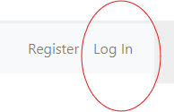
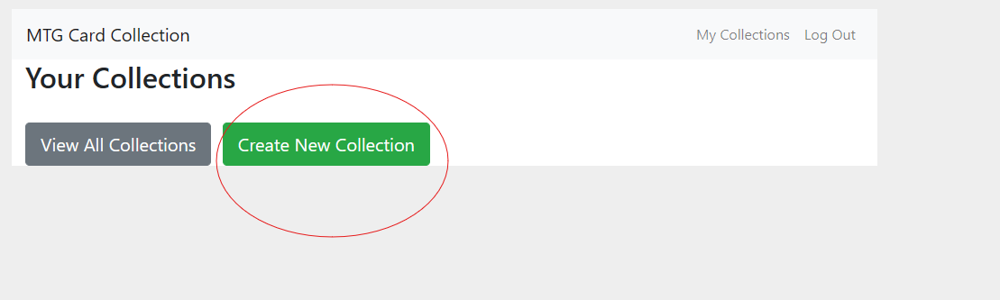
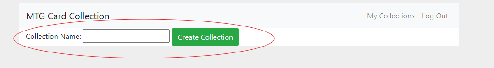
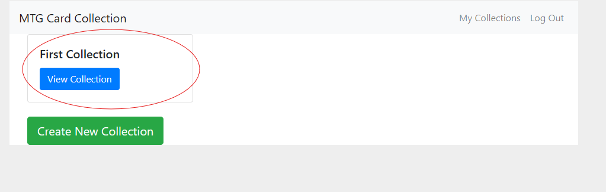
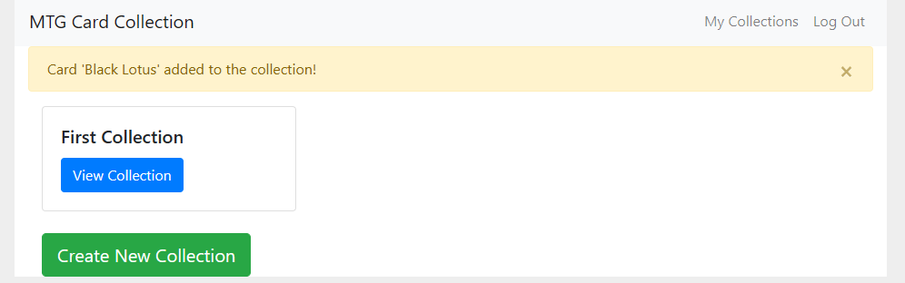

### INF601 - Advanced Programming in Python
### Davon Morris
### Mini Project 3


# Mini Project 3 - Flask

## Description

This project demonstrates building a web application using [Flask](https://flask.palletsprojects.com), a micro web framework in Python. 

The application allows users to manage their [Magic: The Gathering](https://magic.wizards.com/) card collection, with features to create collections, add cards to collections, and view their collection.


## Getting Started

### Dependencies

```
pip install -r requirements.txt
```
### Installing

* Clone my repository to your IDE configured to run Python 3.12

### Setup Database

```
flask --app flaskr init-db  
```

### Start Website

```
flask --app flaskr run --debug
```

### Go to website [http://127.0.0.1:5000/](http://127.0.0.1:5000/)

### For your first time, click register at the top right:


### Choose a username and password, and then choose "Log In" at the top right. 


### Log in with the credentials you set up in the previous step. 

### You will arrive at the home page for your collections.

### Click the green "Create New Collection" to create your first collection


### Choose a collection name, and then click "Create Collection"


### You will be taken back to the home page, go ahead and click "View Collection" on the Collection that you created.


### Add your first card by clicking "Add Card"


### Search for the card of your choice, and click "Add Card", try to be specific as possible with the name


### If a valid card name was chosen, you will be taken to the home screen and told that it was added to your collection


### You have successfully added your first card to your collection!


## Authors

Davon Morris

## Acknowledgments
[Flask Documentation](https://flask.palletsprojects.com/en/2.2.x/) - For comprehensive guidance on using the Flask framework.

[Scryfall API](https://scryfall.com/docs/api) - For providing card data and images for Magic: The Gathering.

[Bootstrap Documentation](https://getbootstrap.com/docs/4.5/getting-started/introduction/) - For styling and layout of the web pages.

[Stack Overflow](https://stackoverflow.com/) - For answering specific questions and providing solutions to coding challenges.

[GeeksforGeeks](https://www.geeksforgeeks.org/) - For tutorials and explanations on various programming concepts.

[W3Schools](https://www.w3schools.com/) - For clear and concise explanations of web development technologies.

[Scrython](https://github.com/NandaScott/Scrython): [Scryfall](https://scryfall.com/) wrapper, not used but very informative
